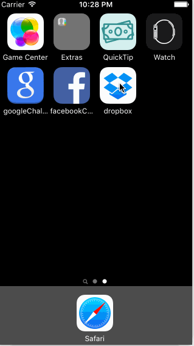

# Week 1 Project - Dropbox

This is an interactive prototype of the Dropbox iPhone app.

Time spent: 6 hours spent in total

Completed user stories:

* [x] Required: User can tap through the 3 welcome screens.
* [x] Required: User can follow the create user flow.
* [x] Required: On the create user form, the user can tap the back button to go to the page where they can sign in or create an account.
* [x] Required: Before creating the account, user can choose to read the terms of service.
* [x] Required: After creating the account, user can view the placeholders for Files, Photos, and Favorites as well as the Settings screen.
* [x] Required: User can log out from the Settings screen.
* [x] Required: User can follow the sign in flow.
* [x] Required: User can tap the area for "Having trouble signing in?"
* [x] Required: User can log out from the Settings screen.
* [x] Optional: User can see a detail view for one of the files and favorite the file.
* [x] Optional: User can actually type in the sign-in form and dismiss the keyboard.
* [x] Optional: User can swipe through the welcome screens instead of just tapping them.

Notes: Favorite state is saved and can be toggled on and off.

GIF created with [LiceCap](http://www.cockos.com/licecap/)
